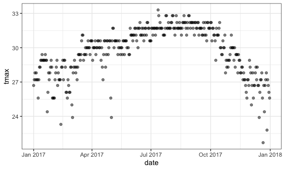

Viz2
================
Ying Chen (UNI: yc384)
10/1/2019

# change homework Mr. Trash Wheel.

``` r
##cache ::: does not go back to the server to download every time you reach the data

weather_df = 
  rnoaa::meteo_pull_monitors(
    c("USW00094728", "USC00519397", "USS0023B17S"),
    var = c("PRCP", "TMIN", "TMAX"), 
    date_min = "2017-01-01",
    date_max = "2017-12-31") %>%
  mutate(
    name = recode(id, USW00094728 = "CentralPark_NY", 
                      USC00519397 = "Waikiki_HA",
                      USS0023B17S = "Waterhole_WA"),
    tmin = tmin / 10,
    tmax = tmax / 10) %>%
  select(name, id, everything())
```

    ## Registered S3 method overwritten by 'crul':
    ##   method                 from
    ##   as.character.form_file httr

    ## Registered S3 method overwritten by 'hoardr':
    ##   method           from
    ##   print.cache_info httr

    ## file path:          /Users/macbook/Library/Caches/rnoaa/ghcnd/USW00094728.dly

    ## file last updated:  2019-09-04 21:33:58

    ## file min/max dates: 1869-01-01 / 2019-09-30

    ## file path:          /Users/macbook/Library/Caches/rnoaa/ghcnd/USC00519397.dly

    ## file last updated:  2019-09-04 21:34:09

    ## file min/max dates: 1965-01-01 / 2019-09-30

    ## file path:          /Users/macbook/Library/Caches/rnoaa/ghcnd/USS0023B17S.dly

    ## file last updated:  2019-09-04 21:34:13

    ## file min/max dates: 1999-09-01 / 2019-09-30

``` r
weather_df
```

    ## # A tibble: 1,095 x 6
    ##    name           id          date        prcp  tmax  tmin
    ##    <chr>          <chr>       <date>     <dbl> <dbl> <dbl>
    ##  1 CentralPark_NY USW00094728 2017-01-01     0   8.9   4.4
    ##  2 CentralPark_NY USW00094728 2017-01-02    53   5     2.8
    ##  3 CentralPark_NY USW00094728 2017-01-03   147   6.1   3.9
    ##  4 CentralPark_NY USW00094728 2017-01-04     0  11.1   1.1
    ##  5 CentralPark_NY USW00094728 2017-01-05     0   1.1  -2.7
    ##  6 CentralPark_NY USW00094728 2017-01-06    13   0.6  -3.8
    ##  7 CentralPark_NY USW00094728 2017-01-07    81  -3.2  -6.6
    ##  8 CentralPark_NY USW00094728 2017-01-08     0  -3.8  -8.8
    ##  9 CentralPark_NY USW00094728 2017-01-09     0  -4.9  -9.9
    ## 10 CentralPark_NY USW00094728 2017-01-10     0   7.8  -6  
    ## # … with 1,085 more rows

``` r
weather_df %>% 
  ggplot(aes(x = tmin, y = tmax)) + 
  geom_point(aes(color = name), alpha = .5)
```

    ## Warning: Removed 15 rows containing missing values (geom_point).


add labels

``` r
weather_df %>% 
  ggplot(aes(x = tmin, y = tmax)) + 
  geom_point(aes(color = name), alpha = .5) + 
  labs(
    title = "Temperature plot",
    x = "Minimum daily temperature (C)",
    y = "Maxiumum daily temperature (C)",
    caption = "Data from the rnoaa package"
  )
```

    ## Warning: Removed 15 rows containing missing values (geom_point).


``` r
weather_df %>% 
  ggplot(aes(x = tmin, y = tmax)) + 
  geom_point(aes(color = name), alpha = .5) + 
  labs(
    title = "Temperature plot",
    x = "Minimum daily temperature (C)",
    y = "Maxiumum daily temperature (C)",
    caption = "Data from the rnoaa package") + 
  scale_x_continuous(
    breaks = c(-15, 0, 15), 
    labels = c("-15º C", "0", "15"))
```

    ## Warning: Removed 15 rows containing missing values (geom_point).

 x
axis tick marks etc Caption: add footnote on the bottom right

``` r
weather_df %>% 
  ggplot(aes(x = tmin, y = tmax)) + 
  geom_point(aes(color = name), alpha = .5) + 
  labs(
    title = "Temperature plot",
    x = "Minimum daily temperature (C)",
    y = "Maxiumum daily temperature (C)",
    caption = "Data from the rnoaa package") + 
  scale_x_continuous(
    # change default breaks
    # specific part to show up
    breaks = c(-15, 0, 15), 
    # change the ticks
    labels = c("-15ºC", "0", "15: just right"),
    limits = c(-20, 30)) + 
  scale_y_continuous(
    # direct transformation of data
    trans = "sqrt", 
    position = "right")
```

    ## Warning in self$trans$transform(x): NaNs produced

    ## Warning: Transformation introduced infinite values in continuous y-axis

    ## Warning: Removed 90 rows containing missing values (geom_point).


``` r
  # scale_y_sqrt() controlling the scales the same way

#### Colors
#### change default colors
#### scale_color_ functions to change
weather_df %>% 
  ggplot(aes(x = tmin, y = tmax)) + 
  geom_point(aes(color = name), alpha = .5) + 
  labs(
    title = "Temperature plot",
    x = "Minimum daily temperature (C)",
    y = "Maxiumum daily temperature (C)",
    caption = "Data from the rnoaa package") + 
  scale_color_hue(name = "Can change to anything: Location", h = c(50, 250))
```

    ## Warning: Removed 15 rows containing missing values (geom_point).


``` r
  # not always recommended to use _huge functions.
  # h = c(100, 300)) change the range
```

viridis::scale\_fill\_viridis() package from yellow to purpose viridis
help with color blinded people general rule to use this pattern

``` r
ggp_base = 
  weather_df %>% 
  ggplot(aes(x = tmin, y = tmax)) + 
  geom_point(aes(color = name), alpha = .5) + 
  labs(
    title = "Temperature plot",
    x = "Minimum daily temperature (C)",
    y = "Maxiumum daily temperature (C)",
    caption = "Data from the rnoaa package"
  ) + 
  viridis::scale_color_viridis(
    name = "Location", 
    discrete = TRUE # variable used here is discrete!
  )

ggp_base
```

    ## Warning: Removed 15 rows containing missing values (geom_point).


``` r
### Themes
### Based on the base plot, we now can change the themes
### change the general rules, but not the data

### General rule to put legend on the bottom by default
ggp_base + 
  theme(legend.position = "bottom")
```

    ## Warning: Removed 15 rows containing missing values (geom_point).


``` r
### Change the background color
### change the "bottom" to "none".
### theme_minimal() takes out everything
### Order does matter
### ggtheme packages

#ggp_temp_plot + 
#  theme_bw() + 
#  theme(legend.position = "bottom")

#ggp_temp_plot + 
#  ggthemes::theme_excel() + 
# theme(legend.position = "bottom")

ggplot(weather_df, aes(x = date, y = tmax, color = name)) + 
  geom_smooth(se = FALSE) + 
  geom_point(aes(size = prcp), alpha = .75) + 
  labs(
    title = "Temperature plot",
    x = "Date",
    y = "Maxiumum daily temperature (C)",
    caption = "Data from the rnoaa package"
  ) + 
  viridis::scale_color_viridis(discrete = TRUE) + 
  theme_minimal()
```

    ## `geom_smooth()` using method = 'loess' and formula 'y ~ x'

    ## Warning: Removed 3 rows containing non-finite values (stat_smooth).

    ## Warning: Removed 3 rows containing missing values (geom_point).


``` r
  #theme(legend.position = "bottom")
```

moderately pay attention to the warnings Where do my warnings come from
… keep tracking, how many data to be omitted

``` r
weather_df %>% 
  filter(is.na(tmin))
```

    ## # A tibble: 15 x 6
    ##    name       id          date        prcp  tmax  tmin
    ##    <chr>      <chr>       <date>     <dbl> <dbl> <dbl>
    ##  1 Waikiki_HA USC00519397 2017-04-17     5  28.3    NA
    ##  2 Waikiki_HA USC00519397 2017-05-09    NA  NA      NA
    ##  3 Waikiki_HA USC00519397 2017-05-26    NA  NA      NA
    ##  4 Waikiki_HA USC00519397 2017-07-19    NA  NA      NA
    ##  5 Waikiki_HA USC00519397 2017-10-07     0  31.1    NA
    ##  6 Waikiki_HA USC00519397 2017-10-09     0  28.9    NA
    ##  7 Waikiki_HA USC00519397 2017-10-10    10  31.7    NA
    ##  8 Waikiki_HA USC00519397 2017-10-12     0  31.1    NA
    ##  9 Waikiki_HA USC00519397 2017-10-13     0  31.1    NA
    ## 10 Waikiki_HA USC00519397 2017-10-16     5  30      NA
    ## 11 Waikiki_HA USC00519397 2017-10-18     0  29.4    NA
    ## 12 Waikiki_HA USC00519397 2017-10-20    13  30.6    NA
    ## 13 Waikiki_HA USC00519397 2017-10-21     0  30      NA
    ## 14 Waikiki_HA USC00519397 2017-10-22     0  30      NA
    ## 15 Waikiki_HA USC00519397 2017-12-22     0  26.7    NA

## more than one dataset

``` r
central_park = 
  weather_df %>% 
  filter(name == "CentralPark_NY")

waikiki = 
  weather_df %>% 
  filter(name == "Waikiki_HA")

ggplot(data = waikiki, aes(x = date, y = tmax, color = name)) + 
  # size here applies only to the waikiki data
  geom_point(aes(size = prcp)) + 
  # connect dots, stack it to my plots above
  geom_line(data = central_park)
```

    ## Warning: Removed 3 rows containing missing values (geom_point).


``` r
# brief adside about colors
### color not working
waikiki %>% 
  ggplot(aes(x = date, y = tmax)) + 
  geom_point(alpha = 0.5,coldor = "blue")
```

    ## Warning: Ignoring unknown parameters: coldor
    
    ## Warning: Removed 3 rows containing missing values (geom_point).



## multi-panel plots

``` r
ggp_density = 
  weather_df %>% 
  ggplot(aes(x = name, y = tmax), color = name) +
  ## factor order is by alphabetic order
  geom_boxplot(
  )
ggp_density
```

    ## Warning: Removed 3 rows containing non-finite values (stat_boxplot).


``` r
# more ggplots and add panels
```

``` r
tmax_tmin_p = 
  weather_df %>% 
  ggplot(aes(x = tmax, y = tmin, color = name)) + 
  geom_point(alpha = .5) +
  theme(legend.position = "none")

prcp_dens_p = 
  weather_df %>% 
  filter(prcp > 0) %>% 
  ggplot(aes(x = prcp, fill = name)) + 
  geom_density(alpha = .5) + 
  theme(legend.position = "none")

tmax_date_p = 
  weather_df %>% 
  ggplot(aes(x = date, y = tmax, color = name)) + 
  geom_point(alpha = .5) +
  geom_smooth(se = FALSE) + 
  theme(legend.position = "bottom")

### patchwork is the way to go!!!
### can arrange the way and order
(tmax_tmin_p + prcp_dens_p) / tmax_date_p
```

    ## Warning: Removed 15 rows containing missing values (geom_point).

    ## `geom_smooth()` using method = 'loess' and formula 'y ~ x'

    ## Warning: Removed 3 rows containing non-finite values (stat_smooth).

    ## Warning: Removed 3 rows containing missing values (geom_point).


``` r
weather_df %>%
  mutate(name = forcats::fct_relevel(name, c("Waikiki_HA", "CentralPark_NY", "Waterhole_WA"))) %>% 
  ggplot(aes(x = name, y = tmax)) + 
  geom_violin(aes(fill = name), color = "blue", alpha = .5) + 
  theme(legend.position = "bottom")
```

    ## Warning: Removed 3 rows containing non-finite values (stat_ydensity).


##### all these functions

fct\_reorder fct\_relevel forcats

## Plotting density of min and max temperatures of different location

## restructure then plot

## two temperature varaibles. recode

``` r
weather_df %>%
  select(name, tmax, tmin) %>% 
  pivot_longer(
    tmax:tmin,
    names_to = "observation", 
    values_to = "temp") %>% 
  ggplot(aes(x = temp, fill = observation)) +
  geom_density(alpha = .5) + 
  facet_grid(~name) + 
  viridis::scale_fill_viridis(discrete = TRUE)
```

    ## Warning: Removed 18 rows containing non-finite values (stat_density).


``` r
pulse_data = 
  haven::read_sas("./data/public_pulse_data.sas7bdat") %>%
  janitor::clean_names() %>%
  pivot_longer(
    bdi_score_bl:bdi_score_12m,
    names_to = "visit", 
    names_prefix = "bdi_score_",
    values_to = "bdi") %>%
  select(id, visit, everything()) %>%
  mutate(visit = recode(visit, "bl" = "00m"),
         visit = factor(visit, levels = str_c(c("00", "01", "06", "12"), "m"))) %>%
  arrange(id, visit)

ggplot(pulse_data, aes(x = visit, y = bdi)) + 
  geom_boxplot()
```

    ## Warning: Removed 879 rows containing non-finite values (stat_boxplot).


``` r
pup_data = 
  read_csv("./data/FAS_pups.csv", col_types = "ciiiii") %>%
  janitor::clean_names() %>%
  mutate(sex = recode(sex, `1` = "male", `2` = "female")) 

litter_data = 
  read_csv("./data/FAS_litters.csv", col_types = "ccddiiii") %>%
  janitor::clean_names() %>%
  select(-pups_survive) %>%
  separate(group, into = c("dose", "day_of_tx"), sep = 3) %>%
  mutate(wt_gain = gd18_weight - gd0_weight,
         day_of_tx = as.numeric(day_of_tx))

fas_data = left_join(pup_data, litter_data, by = "litter_number") 

### tidy problem, not ggplot problem
fas_data %>% 
  select(sex, dose, day_of_tx, pd_ears:pd_walk) %>% 
  pivot_longer(
    pd_ears:pd_walk,
    names_to = "outcome", 
    values_to = "pn_day") %>% 
  drop_na() %>% 
  mutate(outcome = forcats::fct_reorder(outcome, day_of_tx, median)) %>% 
  ggplot(aes(x = dose, y = pn_day)) + 
  geom_violin() + 
  facet_grid(day_of_tx ~ outcome)
```


``` r
fas_data %>% 
  select(sex, dose, day_of_tx, pd_ears:pd_walk) %>% 
  pivot_longer(
    pd_ears:pd_walk,
    names_to = "outcome", 
    values_to = "pn_day") %>% 
  drop_na() %>% 
  mutate(
    outcome = factor(outcome),
    outcome = forcats::fct_reorder(outcome, pn_day, median)) %>% 
  ggplot(aes(x = dose, y = pn_day)) + 
  geom_violin() + 
  facet_grid(day_of_tx ~ outcome)
```


Take home message both what ggplot can do and what data tidy process
that you need to consider
